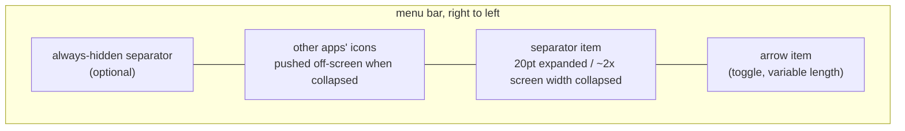
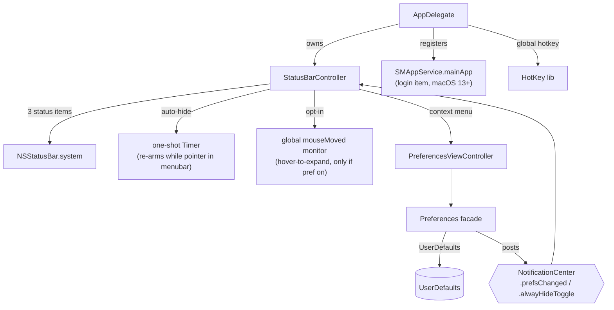

# Architecture

Hidden Bar is a single-process, sandboxed AppKit menubar utility (~1.5k lines of
Swift, one dependency: [HotKey](https://github.com/soffes/HotKey)). There is no
helper app, no daemon, no network. Everything happens inside three
`NSStatusItem`s and one window.

## The core trick

macOS offers no API to hide other apps' menubar icons. Hidden Bar fakes it with
geometry: a separator status item whose **length is inflated to roughly the
width of the widest attached screen**, shoving every icon to its left off-screen.
Collapsing and expanding is just flipping that length between ~20pt and the
inflated value.

Key consequences of this design:

- The menubar replicates on every display, so the collapse length derives from
  the **widest** screen (`NSScreen.screens`), never `NSScreen.main`, and is
  re-applied to the live item on `didChangeScreenParametersNotification`
  (display hot-plug).
- The length is bounded: `max(500, min(widestFrameWidth * 2, 10_000))`. macOS
  enforces a hard 10,000pt maximum on `NSStatusItem.length`.
- **On macOS 27+ that computed length is only a ceiling, not the value applied.**
  macOS 27 ejects a status item too long to fit from the menu bar layout instead
  of reflowing around it, and an ejected item pushes nothing, so the collapse
  width is binary-searched against the live bar on the first collapse and cached
  (see "The macOS 27 menu bar" below).
- `isCollapsed` is derived state: `separator.length > 20`, deliberately not an
  equality check, so it survives the length being recomputed while collapsed.
- Icons macOS inserts to the LEFT of the separator (where new status items
  appear) are in the hidden zone by default; that is inherent to the trick.

## Topology

- **`AppDelegate`** (entry): registers default prefs, sets up the global hotkey,
  runs the one-shot legacy login-item migration, owns the `StatusBarController`.
- **`StatusBarController`** (the product, ~370 lines): the three status items,
  collapse/expand, auto-hide timer, interaction-awareness, hover-to-expand,
  self-restore of dragged-off items.
- **`Preferences`** (facade enum): typed accessors over `UserDefaults`; setters
  post `NotificationCenter` notifications that the controller and prefs window
  observe. There is no other state store.
- **`PreferencesViewController` / `PreferencesWindowController`**: the only
  window (storyboard-based), shown on demand from the context menu.

## Behavior layers on the core trick

| Layer | Mechanism | Cost when unused |
|---|---|---|
| Auto-hide | one-shot `Timer` after expand; at fire, if the pointer sits in any screen's menubar band (`visibleFrame.maxY ... frame.maxY`), it re-arms instead of collapsing | none (single point-in-rect check at fire) |
| Hover-to-expand (opt-in) | global `.mouseMoved` monitor + 0.5s dwell timer; installed only when the `hoverToExpand` default is true at launch | zero: monitor not installed |
| Self-restore | `isVisible = true` forced on our items at launch; Cmd-dragging them off otherwise bricks the app (its only UI is those items) | none |
| Always-hidden section | a second separator item; its own length games, gated by `alwaysHiddenSectionEnabled` | item not created |

## Autostart

macOS 13+ `SMAppService.mainApp`: the app registers itself; the login item is
visible and revocable in System Settings > General > Login Items. On first
launch after upgrade, a one-shot migration deauthorizes the legacy
`com.dwarvesv.LauncherApplication` helper registration (the BTM database never
garbage-collects those; see Apple TN3111). The helper app itself is gone.

## Security posture

Sandboxed (`com.apple.security.app-sandbox`), hardened runtime, no network
entitlement, no file I/O, no IPC surface, no shell or subprocess use. The only
dependency is HotKey (a small Carbon `RegisterEventHotKey` wrapper) locked by
the committed `Package.resolved`. The opt-in hover monitor observes pointer
position only and discards event payloads. About-window links are hardcoded.
A full-tree audit (2026-06) scored 9/10 with hygiene-level findings only.

## Known architectural limits

- **The notch**: hidden icons sit "under" the notch area on notched Macs; the
  trick cannot reveal them there. The real fix is a spillover/second-bar design
  (tracked in issues #357/#341/#148; candidate implementations in PRs #350/#358).
- **macOS 27**: length-inflation still hides, but only within a measured
  window (see below). The managed-overflow redesign remains the durable fix.
- **Other apps' open menus**: interaction-awareness is pointer-position-based;
  a pointer deep inside another app's open dropdown is below the menubar band,
  so the collapse can still fire there.

## The macOS 27 menu bar

macOS 27 renders the whole menu bar as one composited surface instead of one
small window per status item, and changed how it responds to an over-long item.

- `NSStatusItem.length` is still honored exactly: the separator's window really
  does become as wide as it asks.
- What changed is the **layout response**. An item too long to fit is *ejected*
  from the layout rather than laid out, and an ejected item pushes nothing. The
  old `screenWidth * 2` request always lands past that cutoff, which is why
  collapsing did nothing at all on 27 (#360).
- The cutoff is not a constant and cannot be computed: it is where the separator
  would grow past the left edge of the status region, so it moves with the
  display, with the frontmost app's menu width, and with how full the bar is.
- Items pushed past that left edge are taken into macOS 27's own overflow
  chevron, which is what makes hiding work at all there.

`StatusBarController` therefore **measures** the collapse width:

1. On the first collapse, read the separator's arrow-facing edge at rest. This is
   the baseline.
2. Binary-search the largest length that is still laid out. The signal is that
   edge: the separator grows *away* from the arrow, so while it is laid out the
   arrow-facing edge stays put, and an ejected item's edge jumps out by roughly
   the requested length. The item's own width tracks the request in **both**
   states and is useless as a signal - this is why the earlier `windowWidth` /
   `buttonWidth` diagnostic could not tell the two apart.
3. Subtract a safety margin (60pt, ~one icon) and cache the result. The failure
   modes are asymmetric: overshooting ejects the separator and hides *nothing*,
   while undershooting only leaves the icons nearest the separator showing. Any
   icon another app adds after the measurement moves the cutoff down, so the
   margin buys about an icon's worth of room. Both bounds are measured, not
   guessed - see the comment on `ejectionSafetyMargin`.
4. Re-measure when the display configuration changes, and whenever a collapse
   finds the cached length ejected (rate-limited).

Reads are only trustworthy right after the length is written: writing it forces a
re-layout. A frame read taken *without* changing the length returns the last
computed frame, so a background poll reports a stale "fine" even when hiding has
actually stopped. That is why there is no watchdog timer.
